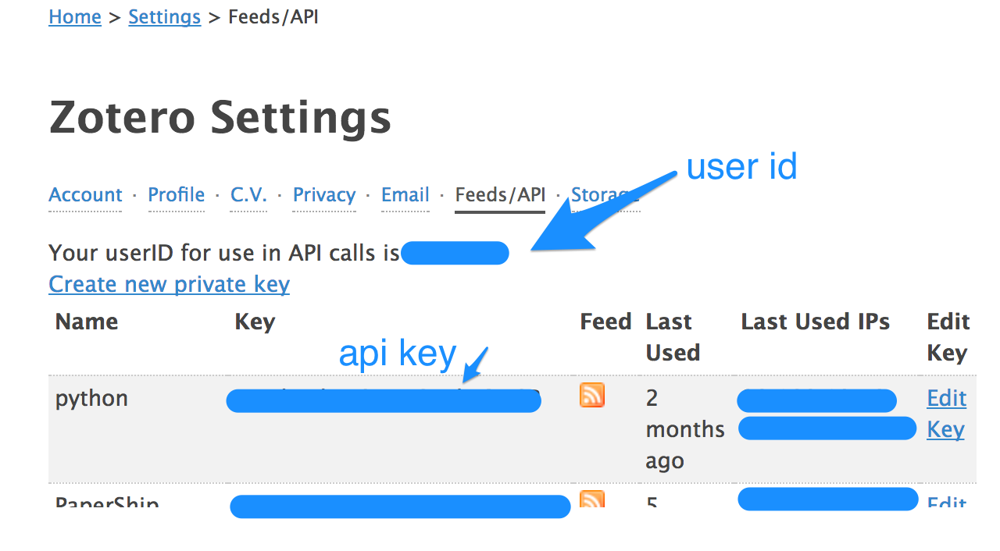

# What's this?
This is a script that generates an annotated bibliography from Zotero.

So, the code as written looks for everything your library with a certain tag (for example "ethics") and then prints an annotated HTML page to the terminal.  I pipe it into an `.html` file and then go from there.

# What do I need in order to make this work?

1. A library that uses tags (or other grouping mechanism to identify candidate items)
2. A library that attaches annotations to the item in Zotero
3. A library that tags those items with a special tag (I'm calling it _annotation_) and that makes sure that that tag is applied _only_ to attatchments and never to top-level items.
4. A terminal to run python scripts

# Alternative approaches (aka, too much background information)
### Using the Abstract Note field
Some folks have gotten around this by replacing the item's official abstract with their own annotations.  This seems like a really bad idea to me for several reasons.  First, what if I want the official abstract?  Abstracts exist for a reason and they're useful.  Second, if you need to re-import your item for any reason, you'll end up overwriting your personal notes because they are stored with data that is supposed to be not-customized and canonical.

### Using BibTeX
You could export your entire library as a BibTeX or a BibLaTeX file and parse that.  I have a very messy version of that in ruby over here.  The challenge was getting the bibliography entries themselves properly formatted, but ruby has [citeproc](https://github.com/inukshuk/citeproc-ruby), which is a great gem for this.

### Using Other Languages
There are other-language version implementations of a zotero API.  I chose pyzotero because it seemed the most stable.

# How to use
2. Open a terminal and install the necessary libraries

        sudo pip install pyzotero
        sudo pip install dominate

3. Make sure you have the `annotated-biblio.py` file locally (you can clone the repo or just download the file directly)

4. Login to Zotero and find two things: your API key and your library ID.  Both pieces of data will be available under Settings > Feeds/API.

5. Update the file with your API information and your filtering criteria.  Around line 28 I'm searching for all items tagged `592-ethics`, so you'll neeed to use a tag that works for you.  The line to update reads: `items = zot.items(sort='creator',direction='asc',tag='592-ethics')
`

6. In terminal, run `python ./annotated-2.py > bibliography.html`

7. Open `bibliography.html` in a browser and see what you get.  I get something that looks like 

8. tweak as needed, make it better, fix some of my bugs and then share your fixes with me!  

# Why isn't it done X way? / You should do Y:
- I thought about using the zotero.children() function, but that will return all children of an item, and so you'll still need a tagged way to determine which child item to include and display.  
- I thought about caching or iterating a different way to make fewer API calls.  Pull requests to do that are totally welcome.  I want to be respectful of the Zotero API.
